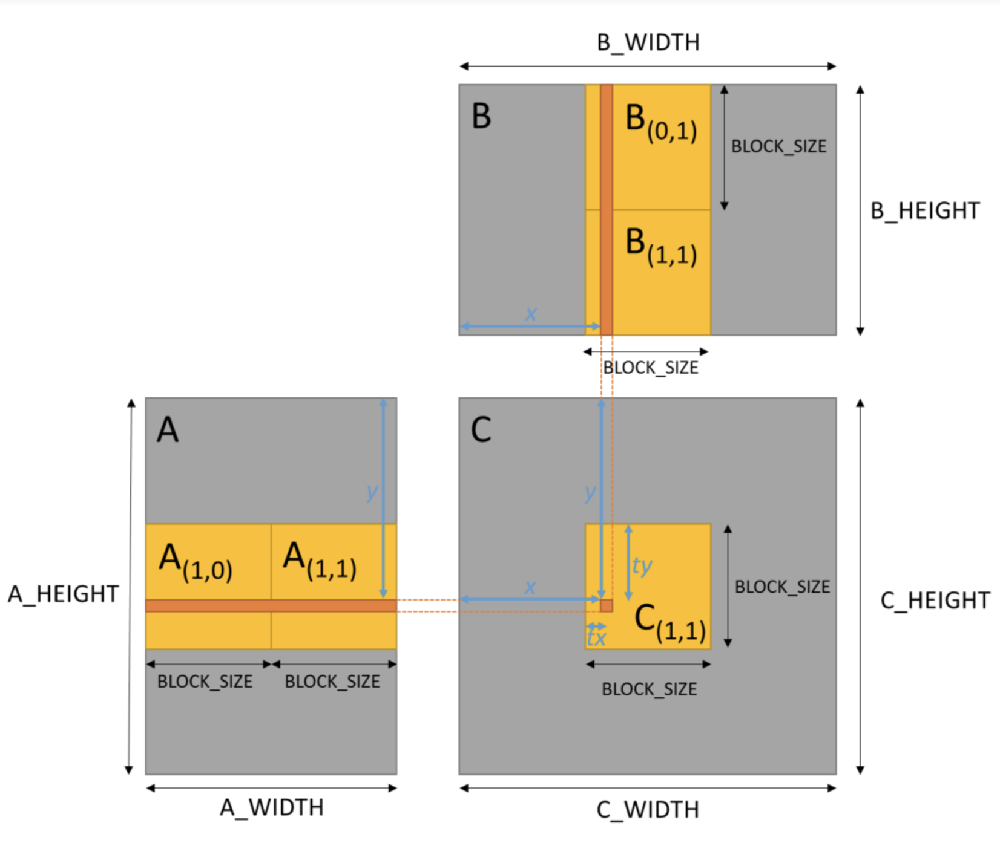

## TP2 : Programmation GPU en CUDA

### Objectifs du TP :
---------------------
* Mesurer le gain de performance en utilisant une version GPU de la multiplication matricielle
* Comprendre comment utiliser la mémoire partagée pour améliorer les performances (avec une multiplication matricielle).
* Comprendre comment utiliser le "tuilage" **tiling** avec la mémoire partagée pour un produit matriciel (Partitionner nos données en sous-groupes de blocs).

### Informations sur le TP :
----------------------------
* Les TPs seront notés à partir d'aujourd'hui (Le TP1 ne l'est pas).
* Le TP est à réaliser seul ou en binôme.
* A rendre sur ametice en spécifiant si vous avez fait le TP seul ou en binôme, en mentionnant votre prénom ainsi que votre nom (prénom et nom de chaque membre si en binôme).


### Exercice 1 : Multiplication de matrices
-------------------------------------------

* Vous programmerez sur le fichier **exercice01.cu**

Pour ce TP, nous connaissons par avance les dimensions de nos matrices (sous forme de **#define** dans le code) :

```C:
#define A_WIDTH 1024
#define A_HEIGHT 1024
#define B_WIDTH 1024
#define B_HEIGHT 1024
#define C_WIDTH B_WIDTH
#define C_HEIGHT A_HEIGHT
```
Nous n'avons donc pas besoins d'allouer de l'espace mémoire avec des **malloc** et **cudaMalloc**.

Voici comment sont définis nos matrices dans le code :

```C:
__device__ float d_A[A_HEIGHT][A_WIDTH];
__device__ float d_B[B_HEIGHT][B_WIDTH];
__device__ float d_C[C_HEIGHT][C_WIDTH];

float h_A[A_HEIGHT][A_WIDTH];
float h_B[B_HEIGHT][B_WIDTH];
float h_C[C_HEIGHT][C_WIDTH];
float h_C_ref[C_HEIGHT][C_WIDTH];
```

Pour cet exercice, vous allez modifier l'implémentation CPU de multiplication de matrices pour le faire tourner sur GPU. la fonction permettant de faire un multiplication matricielle est déja codé sous le nom de **matMulCPU**.

```C:
void matMulCPU(float A[A_HEIGHT][A_WIDTH], float B[C_HEIGHT][C_WIDTH], float C[C_HEIGHT][C_WIDTH])
{
	int x, y, k;
	for (y = 0; y < C_HEIGHT; y++){
		for (x = 0; x < C_WIDTH; x++){
			C[y][x] = 0;
			for (k = 0; k < A_WIDTH; k++){
				C[y][x] += A[y][k] * B[k][x];
			}
		}
	}
}
```

#### 1.1. Partie Host

Avant d'implementer le kernel permettant de faire un multiplication de matrices, il vous faut d'en un premier temps completer la partie **host**.

Dans la fonction **main**, 3 entiers non signés sont déclarés permettant de définir la taille en octets des matrices A, B et C.

```C:
unsigned int octets_A, octets_B, octets_C;
```

##### 1.1.1. Recupérez la taille en octets des matrices A, B, et C.

Completez les instructions suivante :

```C:
	// 1.1.1 Recuperer la taille en octets des matrices A, B et C.
	octets_A = 
	octets_B = 
	octets_C = 
```

##### 1.1.2. Copie de la mémoire Host sur le Device.

Completez les instructions suivante :

```C:
	// 1.1.2 Copie de la memoire Host sur le Device.
	cudaMemcpyToSymbol(A remplir, A remplir, A remplir); //cudaMemcpyToSymbol(destination, source, taille en octets);
	cudaMemcpyToSymbol(A remplir, A remplir, A remplir); //cudaMemcpyToSymbol(destination, source, taille en octets);
	checkCUDAError("CUDA memcpy");
```

##### 1.1.3. Copie du résultat depuis le Device vers l'Host.

Completez l'instruction suivante :

```
	// 1.1.3 Copie du resultat depuis le device vers l'host
	cudaMemcpyFromSymbol(A remplir, A remplir, A remplir); // cudaMemcpyFromSymbol(destination, source, taille en octets);
	checkCUDAError("CUDA memcpy results");
```

#### 1.2. Implémentation GPU

Vous allez maintenant implémenter la version GPU de la multiplication de matrices comme fait dans le TP0, à la différence près que l'on à pas de pointeurs et que l'on alloue donc pas la mémoire de façon dynamique. Vous travaillez donc avec des matrices 2D et non pas avec des vecteurs 1D.

Cette version de multiplication matricielle est différente de celle vue en CM2, vous devez réflichir à comment le modifier pour des matrices 2D

##### 1.2.1 Indexation globale des threads

Completez les instructions suivante dans le kernel matMulKernel :

```C
__global__ void matMulKernel()
{
    // Index des blocs et des threads
	int bx = blockIdx.x;
	int by = blockIdx.y;
	int tx = threadIdx.x;
	int ty = threadIdx.y;
	// 1.2.1 Indexation globale des threads
	int x = 
	int y = 
	
	...
}
```

##### 1.2.2. Multiplication des matrices A et B

Completer l'instrucion suivante afin de faire l'opération de produit scalaire entre une ligne de A et une colonne de B

```C
__global__ void matMulKernel()
{
	...

	float Csub = 0;
	// On itere sur A_WIDTH (meme que B_HEIGHT) pour calculer le produit
	for (int k = 0; k < A_WIDTH; k++){
		// 1.2.2 Produit scalaire entre une ligne de A et une colonne de B
		Csub += 
	}

	// On stocke le resultat dans la matrice C
	d_C[y][x] = Csub;
}
```

#### 1.3. Executez le programme

Executez le programme, il devrait vous sortir le temps d'execution de la version CPU et celui de la version GPU.

Notez ces temps. Vous pouvez ces informations dans un bloc-note ou alors les enregistrer dans un ficher avec la commande:

```bash
./exercice01.cu >> temps-exo-1-3-TP2.txt
``` 

Si vous travaillez sur google Colab, vous pouvez exporter une version pdf **temps-exo-1-3-TP2.pdf** du notebook.

Que constatez vous ?

| Méthode   | Temps     |
|-----------|-----------|
| CPU       |           |
| GPU       |           |


### Exercice 2 : Multiplication de matrices sur la mémoire partagée
------------------------------------------------------------------



L'implémentation GPU multiplie une Matrice A par une Matrice B pour produire une Matrice C. Les largeurs et hauteurs des matrices peuvent être modifiées mais, pour des raisons de simplicité, elles doivent être un facteur du BLOCK\_SIZE (qui a été prédéfini comme une macro dans le code). 

L'implémentation est actuellement très inefficace car elle effectue des chargements mémoire A\_WIDTH × B\_HEIGHT pour calculer chaque produit (valeur dans la matrice C). Pour améliorer cela, nous allons implémenter un produit matriciel par block qui utilise la mémoire partagée de CUDA pour réduire le nombre de lectures mémoire par un facteur de BLOCK\_SIZE. 

Pour implémenter un produit matriciel par block, nous devons charger NUM\_SUBS de sous-matrices carrées des matrices A et B dans la mémoire partagée afin de pouvoir calculer le résultat intermédiaire des produits des sous-matrices. Dans l'exemple de la figure 1 (ci-dessus), la sous-matrice C(1,1) peut être calculée par un bloc de threads carrés de BLOCK\_SIZE par BLOCK\_SIZE où chaque thread (avec l'emplacement tx, ty dans le bloc de threads carrés) exécute les étapes suivantes qui nécessitent deux étapes de chargement des tuiles (sous_matrices) de la matrice dans la mémoire partagée.


Apportez les modifications demandées ci-dessous dans la fonction **matMulKernelSharedMemory()**.
#### 2.1. Indices globaux des blocks et de leur threads.

Calculer les indices globaux des threads des matrices A et B requis pour faire la copie depuis la mémoire globale vers la mémoire partagée. 

```C:
		//2.1: Calculer les indices globaux des threads des matrices A et B requis pour faire la copie depuis la memoire globale vers la memoire partagee. 
       int a_x = ;
       int a_y = ;
       int b_x = ;
       int b_y = ;
```

#### 2.2. Chargement des éléments de A et B dans les sous-matrices As et Bs

Chaque thread doit charger un seul element de A et B dans les sous_matrices As et Bs
Completez la fonction suivante.

```C:
		//2.2: Chaque thread doit charger un seul element de A et B dans les sous_matrices As et Bs
       As[A remplir][A remplir] =
       Bs[A remplir][A remplir] =
```

#### 2.3. Produit matriciel entre les sous-matrices As et Bs

Effectuez le produit matriciel entre la sous-matrice As et la sous-matrice Bs

```C:
		//2.3: Produit matricielle de la As et Bs
		for (int k = 0; k < BLOCK_SIZE; ++k)
		{
			
		}
```

#### 2.4. Indices globaux de threads pour remplir la matrice C

Calculez les indices globaux des threads permettant de stocker le résultat Csub dans la matrice C.

```C:
	//2.4: Calculer les indices globaux des threads de la matrice C
	int c_x = ;
	int c_y = ;
```

#### 2.5 Lancement du kernel

Dans la fonction main, commentez l'appel à **matMulKernel << < grid, threads >> >();** et décommentez l'appel à **matMulKernelSharedMemory << < grid, threads >> >();**

```C
	matMulKernel << < grid, threads >> >();
	//2.5 lancement du kernel
	//matMulKernelSharedMemory << < grid, threads >> >();
    
```

#### 2.6 Execution du programme

Executez le programme et récuperez le temps d'éxecution du kernel matMulKernelSharedMemory ainsi que son **occupation** (calculé dans la première partie du TP).

Notez ce temps et cette occupation. Vous pouvez crire ces informations dans un bloc-note ou alors les enregistrer dans un ficher avec la commande:

```bash
./exercice01.cu >> temps-exo-2-6-TP2.txt
``` 

Si vous travaillez sur google Colab, vous pouvez exporter une version pdf **temps-exo-2-6-TP2.pdf** du notebook.

#### 2.7. Dimensions des blocs

Executez de nouveau le programme avec un BLOCK\_SIZE de 128, puis 256. Recuperez les temps d'executions pour la version GPU normale du produit matriciel et la version avec la mémoire partagée.

Notez ce temps et cette occupation. Vous pouvez crire ces informations dans un bloc-note ou alors les enregistrer dans un ficher avec la commande:

```bash
./exercice01.cu >> temps-exo-2-7-TP2.txt
``` 

Si vous travaillez sur google Colab, vous pouvez exporter une version pdf **temps-exo-2-7-TP2.pdf** du notebook.

| Méthode   | BLOCK\_SIZE | Temps  |
|-----------|-------------|--------|
| GPU       |    128      |        |
| GPU       |    256      |        |
| GPU_shared|    128      |        |
| GPU_shared|    256      |        |


        


